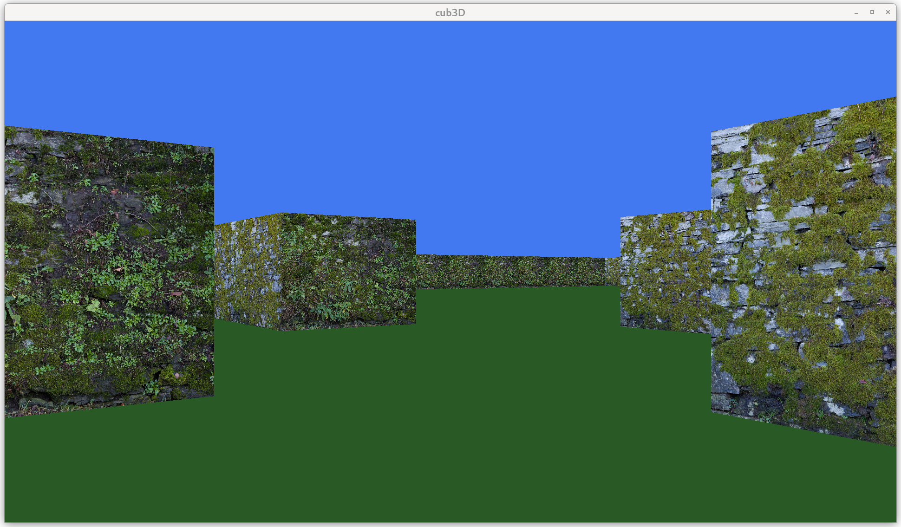

# Wolfy3D
A raycasting game in the style of Wolfenstein3D

## Description
A C program that reads an ASCII map and draws it in first person perspective using raycasting techniques. Supports .png textures for walls. 

Runs on Linux and macOS.

## Installation
Clone this repository and then run: 

    make

The makefile will clone MLX42 from [here](https://github.com/codam-coding-college/MLX42) and build the executable. 

## Usage

Run the program with a map file:

    ./cub3D ./test_files/valid_maps/dungeon1.cub

Move around with WASD keys and turn with the left and right arrow keys. 

Test maps are included in the `test_maps` folder. Maps must have a `.cub` ending. 

